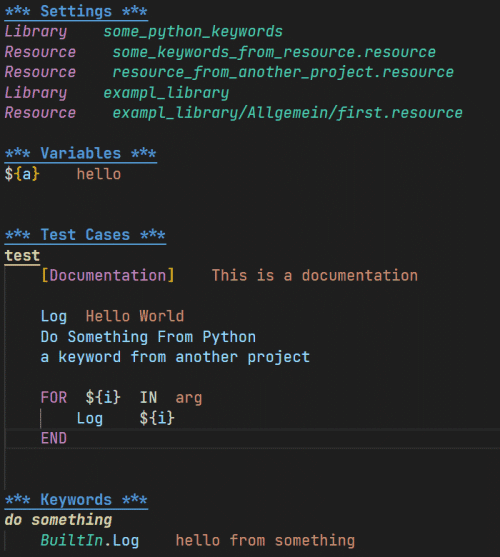

# Tips and Tricks

Here are some tips and tricks that you might find useful when working with RobotCode.

## Customization

### Editor Style

You can change some stylings for RobotFramework files in VSCode editor, independently of the current theme. (see [Customizing a Color Theme](https://code.visualstudio.com/docs/getstarted/themes#_customizing-a-color-theme))

See the difference:

| Before                                                            | After                                                       |
| ----------------------------------------------------------------- | ----------------------------------------------------------- |
|  |  |


As a template you can put the following code to your user settings of VSCode.

Open the user `settings.json` like this:

<kbd>Ctrl</kbd> + <kbd>Shift</kbd> + <kbd>P</kbd> or <kbd>F1</kbd> or <kbd>CMD</kbd> + <kbd>Shift</kbd> + <kbd>P</kbd>

and then type:

`Preferences: Open Settings (JSON)`

put this to the `settings.json`

```jsonc
"editor.tokenColorCustomizations": {
    "textMateRules": [
        {
            "scope": "variable.function.keyword-call.inner.robotframework",
            "settings": {
                "fontStyle": "italic"
            }
        },
        {
            "scope": "variable.function.keyword-call.robotframework",
            "settings": {
                //"fontStyle": "bold"
            }
        },
        {
            "scope": "string.unquoted.embeddedArgument.robotframework",
            "settings": {
                "fontStyle": "italic"
            }
        },
        {
            "scope": "entity.name.function.testcase.name.robotframework",
            "settings": {
                "fontStyle": "bold underline"
            }
        },
        {
            "scope": "entity.name.function.keyword.name.robotframework",
            "settings": {
                "fontStyle": "bold italic"
            }
        },
        {
            "scope": "variable.name.readwrite.robotframework",
            "settings": {
                //"fontStyle": "italic",
            }
        },
        {
            "scope": "keyword.control.import.robotframework",
            "settings": {
                "fontStyle": "italic"
            }
        },
        {
            "scope": "keyword.other.header.setting.robotframework",
            "settings": {
                "fontStyle": "bold underline"
            }
        },
        {
            "scope": "keyword.other.header.variable.robotframework",
            "settings": {
                "fontStyle": "bold underline"
            }
        },
        {
            "scope": "keyword.other.header.testcase.robotframework",
            "settings": {
                "fontStyle": "bold underline"
            }
        },
        {
            "scope": "keyword.other.header.keyword.robotframework",
            "settings": {
                "fontStyle": "bold underline"
            }
        },
        {
            "scope": "keyword.other.header.setting.robotframework",
            "settings": {
                "fontStyle": "bold underline"
            }
        },
        {
            "scope": "keyword.other.header.comment.robotframework",
            "settings": {
                "fontStyle": "bold italic underline"
            }
        },
        {
            "scope": "string.unquoted.escape.robotframework",
            "settings": {
                //"foreground": "#FF0000",
            }
        }
    ]
},

"editor.semanticTokenColorCustomizations": {
    "rules": {
        "*.documentation:robotframework": {
            "fontStyle": "italic",
            //"foreground": "#aaaaaa"
        }
    }
}

```
